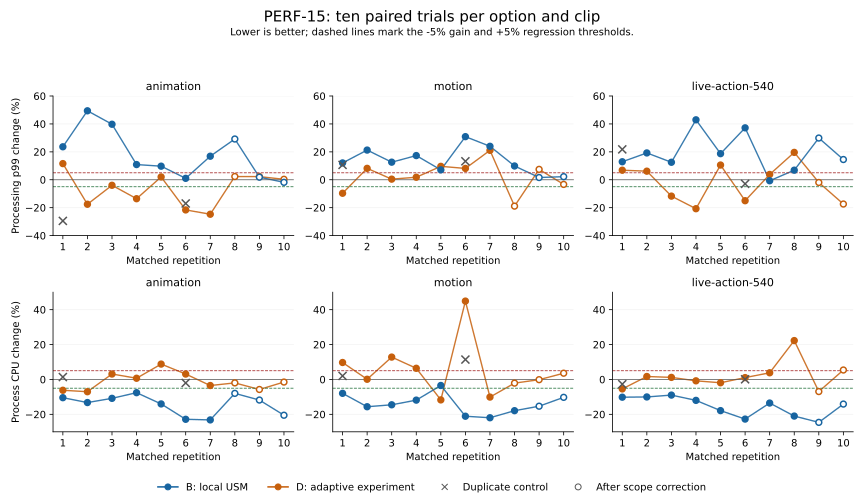

# PERF-15 ten-pair measurement and analysis

## Final measurement scope

The user clarified that the original request meant 100 executions total, then
explicitly selected ten matched pairs per option and clip. Ten pairs across
B (local USM placement), D (experimental adaptive tuning), and three clips means
60 candidate pairs or 120 candidate/reference executions. Six completed
control pairs add 12 executions. No additional controls are requested.

The original batch was stopped with 51 complete pairs: 45 candidate pairs
and six control pairs. An unfinished pair contains one completed reference
and an interrupted candidate; retain both records separately and exclude that
pair from comparisons. The continuation completes only the 15 missing pairs
from the original seeded plan's first ten repetitions. It does not rerun or
discard any completed pair. The measurement step ends at ten candidate pairs
per option/clip and proceeds to analysis, without further automatic repetitions.

Original source, binary, input and completed-pair hashes were verified after
stopping. Original raw data, protocol and measured sources are preserved in
the [retained evidence](benchmarks/perf15-reduced/README.md). The continuation
records its own manifest and the original manifest/pair hashes, and checks that
all timed C sources, executables and input clips still match. The Python budget
handling was corrected separately: default 100 means total executions;
`--repeats 10` explicitly requests ten pairs per candidate/clip plus controls.

All capture settings remain unchanged: separate 90-second processes, 30 fps,
existing clips, production-compatible geometry, fixed scaler workers, default
sharpness, and zero-copy. Each new pair keeps its preplanned randomized order
and an adjacent reference. No other benchmarks, builds or analyzers overlap.
The user-directed pause between groups remains visible in capture timestamps.

## Analysis declared before the remaining captures

Keep all complete pairs and every observed regression. Report geometric mean
of candidate/reference run ratios, median, range, each individual ratio, and
the number of pairs exceeding the 5% regression guard. Report absolute p99
processing times and process CPU alongside percentages. Gains strictly above
5% are reviewable; an observed gain does not automatically qualify a policy.

For each candidate/workload/metric, report a paired-log-ratio t interval with
nine degrees of freedom: both individual 95% intervals and Bonferroni-adjusted
intervals across all 24 candidate/workload/metric comparisons. These intervals
are conditional on independent, normally distributed log differences. They
are not assurances that the desktop workload meets those assumptions.

As dependence sensitivity checks, also report circular block-bootstrap
percentile intervals with lengths two and five, 100,000 resamples, and the
same family adjustment. Ten pairs provide few blocks; these are exploratory
sensitivity estimates, not a guarantee of population coverage. Show the
chronological paired values and original-versus-continuation groups. Do not
choose whichever method produces the most favorable result.

The two duplicate-control pairs per clip support descriptive variation only;
do not invent control confidence intervals or treat frames as independent
experimental repetitions. Old 100-pair eligibility and 25-pair/lag-20 screening
rules do not apply to this explicitly reduced study. Regressions, noisy controls
and method disagreement constrain conclusions rather than triggering more runs.
No default changes or preset promotion follow automatically.

## Interpretation limits

Processing-only, short-session results do not establish decode-to-screen
latency, uninterrupted multi-hour playback, energy savings, or generalization
to all video formats. The new adaptive policy is compared with a fixed reference;
this does not establish that it beats the legacy adaptive policy. Pixel-control
results remain those verified against the unchanged profiling binaries.

The paired calculation follows
[NIST's analysis of paired observations](https://www.itl.nist.gov/div898/handbook/prc/section3/prc311.htm).
The dependence limitation follows
[NIST's discussion of autocorrelated measurements](https://www.nist.gov/publications/calculation-uncertainty-mean-autocorrelated-measurements).
The reduced sample budget, interval sensitivity choices, and review criteria
are this experiment's declared choices.

## Completed results and disposition

Measurement and analysis are complete: ten pairs for each B/D option and clip,
60 candidate pairs plus six retained control pairs, or 132 paired executions.
The continuation added only 15 pairs. Independent checks matched all 356,400
raw frame records to saved run summaries and checked every paired ratio.
Source, executable and input hashes remained unchanged across both groups.
The excluded unfinished pair remains in the stopped-batch archive.

Neither candidate qualifies as a latency improvement under the retained 5%
regression guard. Keep production defaults and existing opt-in behavior.
PERF-15's bounded B/D study is complete; uncertainty does not request another
measurement batch. The local-placement CPU saving is reviewable as a tradeoff,
not a latency preset. The experimental adaptive controller stays in profiling
tests and is not promoted into playback.

Changes below are geometric means of ten paired candidate/reference ratios.
Negative means less time. CPU means process CPU time inside the per-frame
processing window, summed across threads; it is not whole-player CPU usage.

| Clip | B: p99 | B: processing CPU | D: p99 | D: processing CPU |
|---|---|---|---|---|
| Animation | +17.0% | -14.4% | -7.0% | -1.1% |
| Live action, 540p input | +18.7% | -15.7% | -2.8% | +1.8% |
| Motion | +13.5% | -14.2% | +1.9% | +4.4% |

B uses local USM placement on CPUs 0–7 while preserving worker counts. Its
CPU time fell in all 30 candidate pairs; 29 gains exceeded 5%. Family-adjusted
paired-log t intervals for CPU changes are [-22.1%, -6.0%], [-23.1%, -7.5%]
and [-21.5%, -6.1%], respectively. Both block-length sensitivity estimates
also keep the CPU reduction above 5%. However, p99 regressed above 5% in
7/10 animation, 9/10 live-action and 8/10 motion pairs. Mean latency and p95
also rose on every clip. No B pair improved p99 by more than 5%.

For a concrete scale, the live-action B comparison averaged 3.222 ms versus
2.712 ms processing CPU per frame, saving 0.510 ms. At 30 fps that is about
15.3 ms CPU per second, or 1.53% of one logical core. The arithmetic mean of
the ten run-level p99 values rose from 2.659 ms to 3.153 ms, a 0.494 ms cost.
These absolute arithmetic averages differ from the paired geometric changes
above and do not imply energy or whole-player savings.

D's animation p99 point estimate exceeds the 5% review threshold, but its
conditional family-adjusted interval spans -22.3% to +11.3%. Live action spans
-19.6% to +17.4%, and motion -12.5% to +18.7%. Neither block-length sensitivity
estimate establishes a p99 gain above 5% on any clip. D exceeds the p99 guard
in 1/10, 4/10 and 5/10 pairs, respectively. The evidence does not establish a
latency gain above 5%, nor a safe adaptive-policy promotion.

The two duplicate-control p99 changes per clip were -29.5%/-17.0% for animation,
+21.8%/-2.9% for live action and +10.6%/+13.2% for motion. These are descriptive
variation, large enough to obscure D's apparent gains. The t intervals remain
conditional on the stated distribution and independence assumptions; ten-pair
block estimates cannot establish those assumptions.

Hollow points mark continuation captures after the user-directed pause. Gray
crosses are duplicate controls. The CPU panels show processing CPU time per
frame. See the [full numerical tables](benchmarks/perf15-ten-pairs/results.md)
and [machine-readable analysis](benchmarks/perf15-ten-pairs/analysis.json) for
all means, medians, ranges, ratios, individual and adjusted intervals, block
sensitivities, guard counts, absolute times and chronological groups.

## What the existing traces suggest next

D spends about 25–27% of measured frames in exploration rather than settled
operation. That is a frame count, not a measured CPU overhead percentage.
Its dwell/search balance is a possible future tuning target, but this study
does not show that extending dwell or changing search would improve latency.

For each run, an exploratory diagnostic selected its slowest 27 frames (1%).
Across the 66 named reference runs, the mean per-run share of tail wall time
before USM was 95.2%; summed processing CPU was below wall time in 77.0% of
those tail frames. That pattern is consistent with waiting or scheduling
delay and makes the pre-USM interval a more useful next diagnostic target
than another USM placement change. It does not identify the cause.

The CSV column named `zimg` includes source probing, adaptive setup and
scaling; it is not an isolated zimg-library timer. Separate those intervals
and correlate worker wakeups with the same slow frames before attributing
tails to scaling compute or changing scheduling. Input reads, pacing, decoding
and display remain outside the measured frame interval. These are analysis
recommendations, not newly demonstrated bottlenecks or requested extra runs.

## Evidence and validation

The [final archive](benchmarks/perf15-ten-pairs/README.md) links retained raw
captures, exact measured sources and binaries, the frozen protocol, analysis
scripts, numerical results, plot and SHA-256 indexes. Pixel validation remains
the pilot's 15 matching comparisons of 600 frames each against these unchanged
profiling binaries; hashing was disabled during timed captures.

The full warning-as-error automated suite, ASan/UBSan, static analysis,
complexity and documentation checks passed before continuation. Later Python
reporting fixes have permanent normal-suite red/green regressions: the default
100-execution budget, exact-prefix continuation, descriptive short studies
and absent duplicate controls. All 21 confirmation tests pass. The short-study
fix retains guard diagnostics without inventing unsupported intervals or
relaxing the historical 100-pair promotion rule. No further performance runs
are needed to complete this step.
